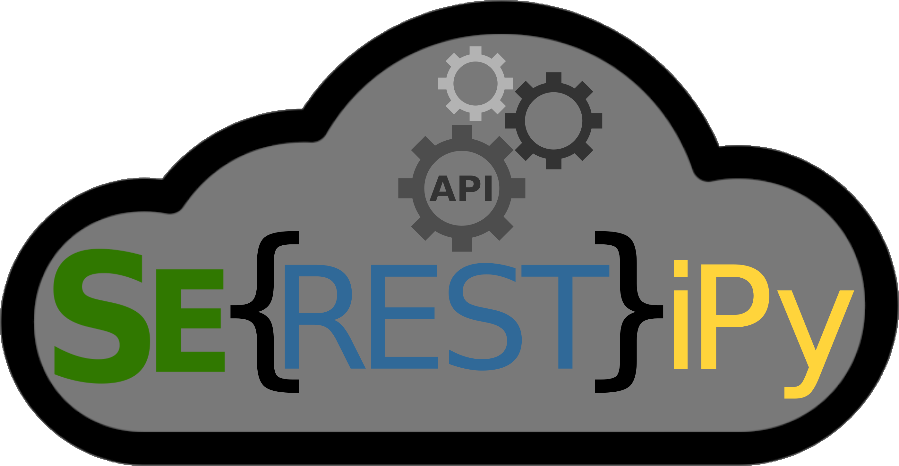

**Table of Contents** 
- [Synopsis](#synopsis)
- [License and Copyright Info](#license-and-copyright-info)
- [Download](#download)  
- [Install](#install)
    - [Prerequisites](#prerequisites)
    - [Install Using Pip](#install-using-pip)
- [Contact](#contact)
    - [Bugs and Feature Requests](#bugs-and-feature-requests)
    - [Other](#other)

## Synopsis
Serestipy is a Python API for the quantum chemistry code Serenity originally developed in the group of Johannes Neugebauer at the WWU Münster.

## License and Copyright Info

Serestipy is free software: you can redistribute it and/or modify
it under the terms of the GNU Lesser General Public License as published by
the Free Software Foundation, either version 3 of the License, or
(at your option) any later version.

This program is distributed in the hope that it will be useful,
but WITHOUT ANY WARRANTY; without even the implied warranty of
MERCHANTABILITY or FITNESS FOR A PARTICULAR PURPOSE.  See the
GNU General Public License for more details.

You should have received a copy of the GNU Lesser General Public License
along with this program.  If not, see <http://www.gnu.org/licenses/>.

## Download 

In order to download the source files of the latest Serestipy release please
visit:  
https://github.com/qcserestipy/serestipy

## Install

Please read the following instructions carefully.

### Prerequisites
The code has been tested and used on Anaconda Python version 3.7
Older Python versions are known to be insufficient.
  
The following programs/python libraries must be available on your system:
 - Serenity compiled with Pybind11 Python bindings (see https://github.com/qcserenity/serenity for installation details)
 - Anaconda Python 3.7
 - Flask v2.0.3
 - Waitress v2.0.0
 - Requests v2.27.1
 - Asyncio
 - Json
 - Mkl (in case Serenity was compiled together with IntelMKL)

### Install Using Pip
Extract or pull the source code, then install using pip:
> cd restApi  
> pip install -e .

## Contact

### Bugs and Feature Requests
For both bugs and feature requests please use the issue tracker on [GitHub](https://github.com/qcserestipy/serestipy).

### Other
For other question, requests or simply to give some feedback feel free to send an e-mail
to: 
p_esch01@uni-muenster.de
